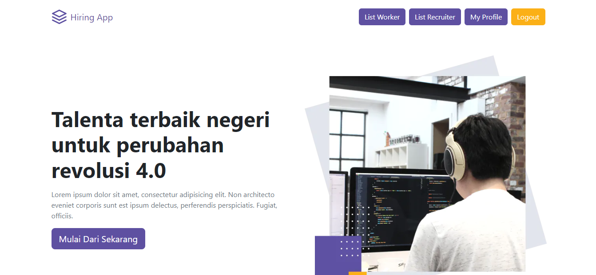
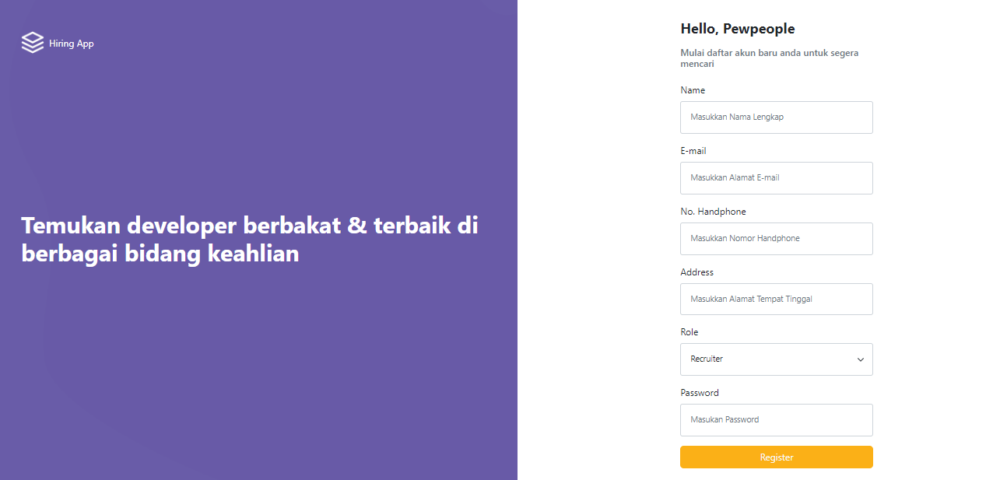
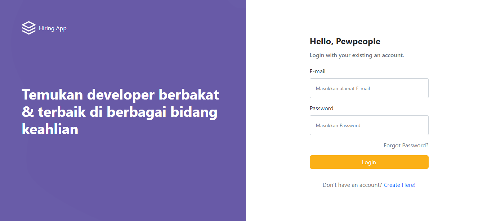
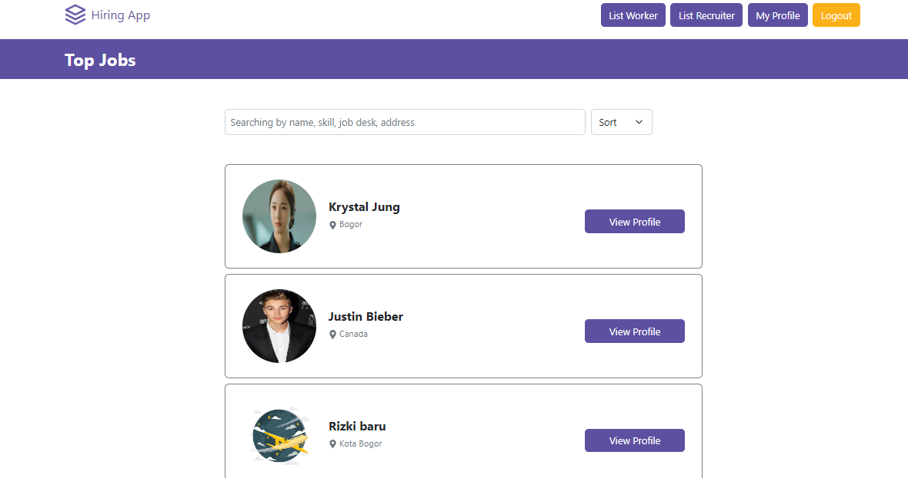
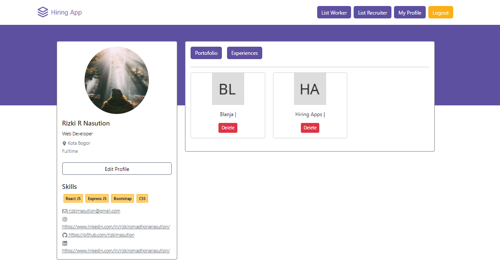
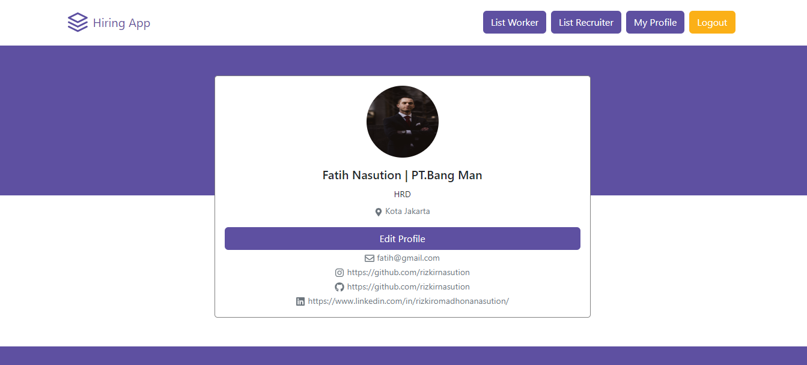
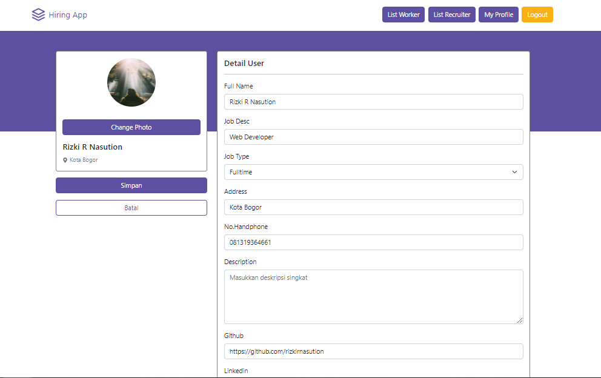
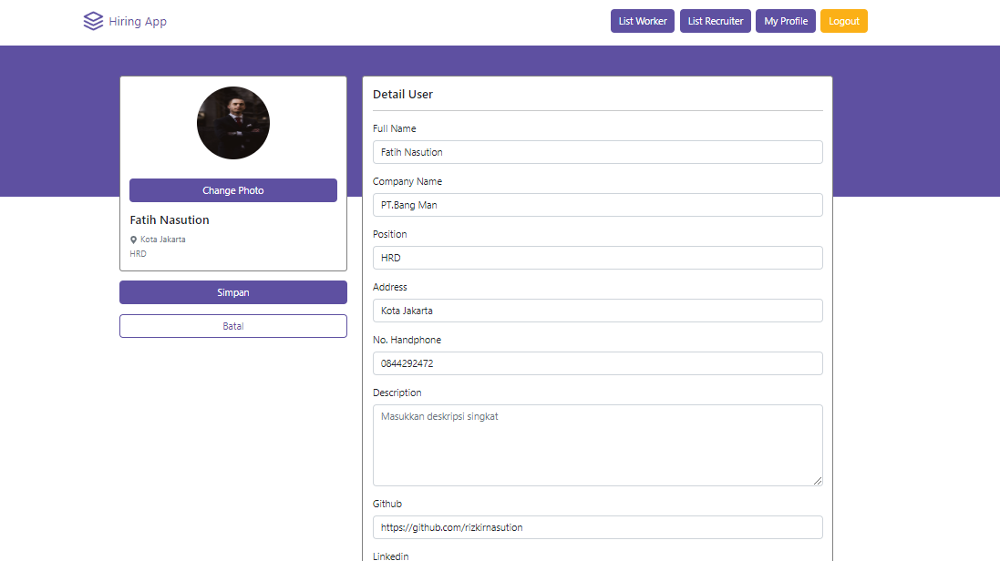

<div align="center">
  
</div>
<h3 align="center">Frontend Hiring Apps</h3>
<p align="center">
  <a href="https://frontend-hiring-apps.vercel.app/">View Demo</a>
</p>

<!-- ABOUT THE PROJECT -->

## About The Project

Hiring Apps is a web application to search for workers and/or jobs with the features of register, log in, find a job for workers, can see list of workers and recruiters, and see profile. This web application is built using NextJS, ExpressJS, PostgreSQL, and WebSocket.

### Technology Used

- [NextJS](https://nextjs.org/)
- [Redux](https://redux.js.org/)
- [Bootstrap](https://getbootstrap.com/)
- [Socket.IO](https://socket.io/)
- [Axios](https://github.com/axios/axios)
- [Moment](https://momentjs.com/)

<!-- GETTING STARTED -->

## Getting Started

### Installation

- Clone This Repository

`git clone https://github.com/rizkirnasution/Frontend-HiringApps.git`

- Install Module

`npm install`

- Setting .env.local

```bash
NEXT_PUBLIC_API_URL =
NEXT_PUBLIC_APP_NAME=
```

### Executing program

- Run this project with `npm run dev`.

<!-- SCREENSHOT -->

## Screenshot

### Home



### Register



### Login



### List Workers



### List Recruiters


### Worker Profile



### Recruiter Profile



### Edit Worker Profile



### Edit Recruiter Profile



<!-- RELATED PROJECT -->

## Related Project

- [Backend Hiring Apss](https://github.com/rizkirnasution/Backend-HiringApps.git)
- [Backend Hiring Apps Demo](https://backend-hiring-apps.vercel.app/)

<!-- CONTACT INFO -->

## Contact Info

Contributors names and contact info:

1. Rizki Romadhona Nasution

- [Linkedin](https://www.linkedin.com/in/rizkiromadhonanasution)

## License

This project is licensed under the MIT License - see the LICENSE file for details
